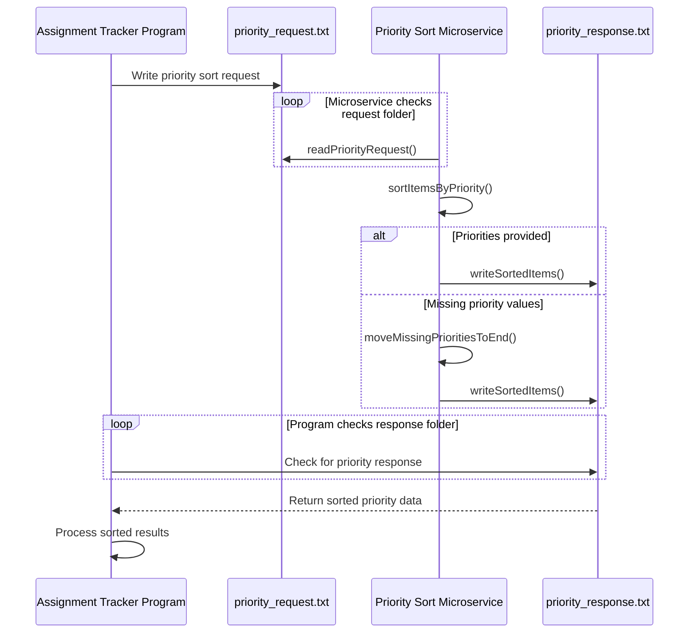

# Priority Sort Microservice

## Description
The Priority Sort Microservice allows another program to send a list of items with priority values and receive the list sorted by priority. Items with missing priority values are placed at the end of the sorted list.

## Communication Pipe
This microservice uses text files as the communication pipe.

The requesting program writes a request text file into a shared `requests` folder. The microservice checks that folder, reads the request, sorts the items, and writes a response text file into a shared `responses` folder.

## How to Request Data
Create a text file named `priority_request.txt` inside the `requests` folder.

Required parameters:
- `item`: the item that needs to be sorted
- `priority`: the priority value for that item

Optional parameter:
- `sort_order`: `descending` or `ascending`

Example request file:

```text
sort_order=descending
item=Biology Exam, priority=5
item=Math Homework, priority=3
item=Discussion Post, priority=1
```

Example request code:

```python
from pathlib import Path

request_file = Path("requests/priority_request.txt")
request_file.write_text(
    "sort_order=descending\n"
    "item=Biology Exam, priority=5\n"
    "item=Math Homework, priority=3\n"
    "item=Discussion Post, priority=1\n",
    encoding="utf-8",
)
```

## How to Receive Data
The microservice creates a response file named `priority_response.txt` inside the `responses` folder.

Example response file:

```text
sorted_items:
Biology Exam, priority=5
Math Homework, priority=3
Discussion Post, priority=1
```

Example receive code:

```python
from pathlib import Path

response_file = Path("responses/priority_response.txt")
response = response_file.read_text(encoding="utf-8")
print(response)
```

## How to Run
Open two terminals from this folder.

Terminal 1:

```bash
python priority_sort_microservice.py
```

Terminal 2:

```bash
python test_program.py
```

## UML Sequence Diagram


